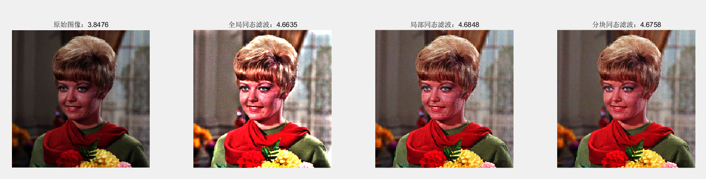

## 基于HSI和局部同态滤波的彩色图像增强算法

论文基本思路：
在 HSI 颜色空间下，对 I 分量进行处理，裁剪成 相同大小的 n×n 图像块，进行同态滤波，以此实现局部增强，但拼接图像时，在边缘必然会存在颜色突变，造成块效应，因此需要解决这个副作用。作者将相邻的图像块分为水平和竖直两类，利用边界处左右两边的像素进行均值滤波，以此来消除块效应。增强后的 I 分量再重新与 S 和 H 分量组合并还原到 RGB 空间。

## 代码实现
作者在论文中已经给出了部分关键代码，因此复现起来很简单。

- **同态滤波实现**

```matlab
function im_e = HomoMor(im,Hh,Hl,D0,c)
%基于HSI和局部同态滤波的彩色图像增强算法
% 作者： 张亚飞 谢明鸿
% 高斯同态滤波器参数的设置
% Hh = 1.2;  % 高频增益,需要大于1
% Hl = 0.5;  % 低频增益,取值在0和1之间
% D0 = 4;    % 截止频率，越大图像越亮
% c = 1;     % 锐化系数

%% 滤波器初始化
im = double(im);
[row, col] = size(im);

% 确定傅里叶变换的原点
x0 = floor(row/2);
y0 = floor(col/2);

% 初始化
H = zeros(row,col);

for i = 1:row
    for j = 1:col
        D = (i-x0)^2 + (j-y0)^2;
        if D == 0
            H(i,j) = Hl;
        else
            H(i,j) = (Hh-Hl) * (1 - exp(-c*D^2/(D0^2))) + Hl;  % 高斯同态滤波函数
        end
    end
end

%% 同态滤波
im_l = log(im + 0.000001);              % 取对数变换
im_f = fftshift(fft2(im_l));            % 傅里叶变换，并移到中心位置
im_nf = H .* im_f;                      % 高斯滤波
im_n = real(ifft2(ifftshift(im_nf)));   % 傅里叶反变换，恢复位置
im_e = exp(im_n - 0.000001);            % 取指数变化

end
```

- **HSV 颜色空间下的全局同态滤波**

```matlab
function rgbim = GlobalHomo(I,Hh,Hl,D0,c)
%全局同态滤波
% rgbim = GlobalHomo(I,Hh,Hl,D0,c)
% I:输入图像
% Hh:高频增益,需要大于1
% Hl:低频增益,取值在0和1之间
% D0:截止频率，越大图像越亮
% c:锐化系数

hsiim = rgb2hsi(I);
im = hsiim(:,:,3);
im_g = HomoMor(im,Hh,Hl,D0,c);
hsiim(:,:,3) = im_g;
rgbim = hsi2rgb(hsiim);
end
```

- **不加块效应消除的分块同态滤波**

```matlab
function rgbim = LocalHomo(I,Hh,Hl,D0,c,block)
% rgbim = GlobalHomo(I,Hh,Hl,D0,c)
% I:输入图像
% Hh:高频增益,需要大于1
% Hl:低频增益,取值在0和1之间
% D0:截止频率，越大图像越亮
% c:锐化系数
% block:分块大小


hsiim = rgb2hsi(I);
im = hsiim(:,:,3);

[row,col] = size(im);
% 块的大小为Mb*Nb
Mb = block; Nb = block;
rb = floor(row/Mb); cb = floor(col/Nb);
im_g = im;
for i =1:rb
    for j = 1:cb
        temp = im((i-1)*Mb+1:i*Mb , (j-1)*Nb+1:j*Nb);
        im_g((i-1)*Mb+1:i*Mb , (j-1)*Nb+1:j*Nb) = HomoMor(temp,Hh,Hl,D0,c);
    end
end
hsiim(:,:,3) = im_g;
rgbim = hsi2rgb(hsiim);

end
```

- **加去除块效应的分块同态滤波**

```matlab
function rgbim = BlockHomo(I,Hh,Hl,D0,c,block)
%分块同态滤波
% rgbim = GlobalHomo(I,Hh,Hl,D0,c)
% I:输入图像
% Hh:高频增益,需要大于1
% Hl:低频增益,取值在0和1之间
% D0:截止频率，越大图像越亮
% c:锐化系数
% block:分块大小


hsiim = rgb2hsi(I);
im = hsiim(:,:,3);

[row,col] = size(im);
% 块的大小为Mb*Nb
Mb = block; Nb = block;
rb = floor(row/Mb); cb = floor(col/Nb);
im_g = im;
for i =1:rb
    for j = 1:cb
        temp = im((i-1)*Mb+1:i*Mb , (j-1)*Nb+1:j*Nb);
        im_g((i-1)*Mb+1:i*Mb , (j-1)*Nb+1:j*Nb) = HomoMor(temp,Hh,Hl,D0,c);
    end
end

% 分块同态滤波 
M = 3; N = 3;
n0 = floor(N/2); m0 = floor(M/2);
Ide = im_g;

% 去除水平相邻子图像块效应
for i = 1:row
    for j = Nb:Nb:col-Nb
        temp1 = 0;
        temp2 = 0;
        for k = -n0:n0
            temp1 = temp1 + im_g(i,j+k);
            temp2 = temp2 + im_g(i,j+1+k);
        end
        Ide(i,j) = temp1/N;
        Ide(i,j+1) = temp2/N;
    end
end
% 去除垂直相邻子图像块效应
for i = Mb:Mb:row-Nb
    for j =  1:col
        temp1 = 0;
        temp2 = 0;
        for k = -m0:m0
            temp1 = temp1 + im_g(i+k,j);
            temp2 = temp2 + im_g(i+1+k,j);
        end
        Ide(i,j) = temp1/M;
        Ide(i+1,j) = temp2/M;
    end
end
hsiim(:,:,3) = Ide;
rgbim = hsi2rgb(hsiim);

end
```

- **局部平均信息熵**

```matlab
function en = BlockAvEn(I,block)
%局部平均信息熵
% en = BlockAvEn(I,block)
% I:输入图像
% block:分块大小
en = 0;
[row,col,channel] = size(I);
% 块的大小为Mb*Nb
Mb = block; Nb = block;
rb = floor(row/Mb); cb = floor(col/Nb);
for c = 1:channel
    im = I(:,:,c);
    for i =1:rb
        for j = 1:cb
            temp = im((i-1)*Mb+1:i*Mb , (j-1)*Nb+1:j*Nb);
            en = en + entropy(temp);
        end
    end
end
en = en/(rb*cb*channel);
end

```

- **结果对比**

```matlab
close all;clear;clc
addpath('model');
addpath('src');


%  读取图像
I = imread('4.1.01.tiff');
en = BlockAvEn(I,8);

% 全局同态滤波
rgbim0 =  GlobalHomo(I,1.2,0.5,50,1);
en0 = BlockAvEn(rgbim0,8);

% 局部同态滤波
rgbim1 = LocalHomo(I,1.2,0.5,4,1,8);
en1 = BlockAvEn(rgbim1,8);

% 分块同态滤波 
rgbim2 = BlockHomo(I,1.2,0.5,4,1,8);
en2 = BlockAvEn(rgbim2,8);

figure(1)
subplot(1,4,1)
imshow(I);
title(['原始图像：',num2str(en)])

subplot(1,4,2)
imshow(rgbim0);
title(['全局同态滤波：',num2str(en0)])

subplot(1,4,3)
imshow(rgbim1);
title(['局部同态滤波：',num2str(en1)])

subplot(1,4,4)
imshow(rgbim2);
title(['分块同态滤波：',num2str(en2)])
```

## 结果



|           图像           | 原文的局部平均信息熵 | 复现的局部平均信息熵 |
| :----------------------: | :------------------: | :------------------: |
|         原始图像         |        3.8476        |        3.8476        |
|       全局同态滤波       |        4.6636        |        4.6635        |
|       局部同态滤波       |        4.6848        |        4.6848        |
| 去除块效应的局部同态滤波 |        4.6740        |        4.6758        |


## 总结

根据复现结果来看，基本实现了与论文一致的增强效果。但仔细观察发现，其实去除块效应后的图像仍存在一定的边缘突变像素，因为滤波过程中，这些像素的值出现了过度增强，难以通过局部均值进行融合。